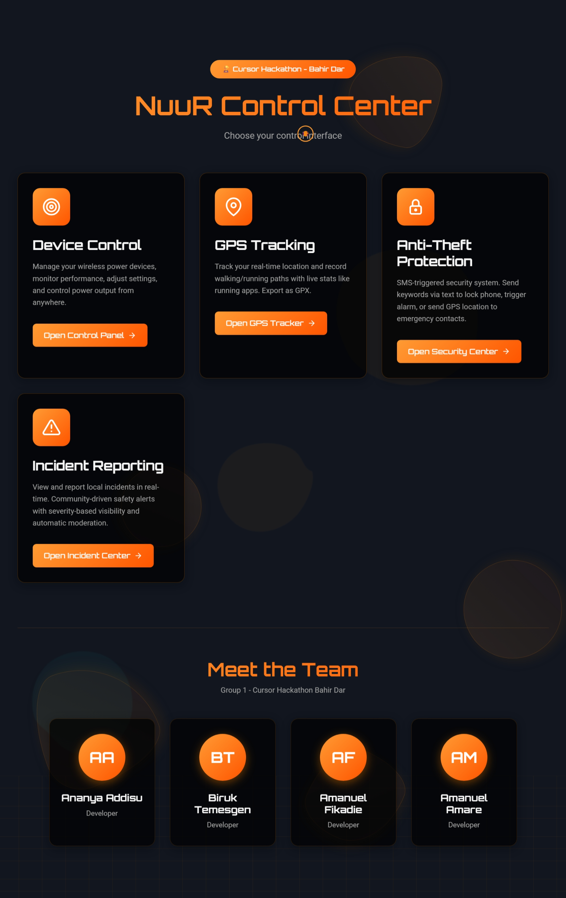
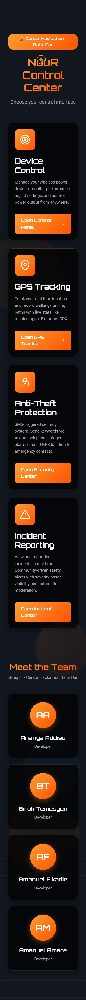

# NuuR - Urban Safety Platform for Ethiopian Cities

  

## Overview

NuuR is a comprehensive web-based safety platform designed for Ethiopian urban environments. Built during a **hackathon**, it provides three core safety features:

1. **Anti-Theft Protection** - SMS-triggered remote tracking and alert system  
2. **Path Tracker** - Movement history recording and route replay  
3. **Emergency Issue Reporting** - Rapid geo-tagged incident reporting  

---

## Technology Stack

- **Frontend:** React 18+ with TypeScript, React Router, TailwindCSS, PWA support, i18next for localization  
- **Backend:** FastAPI (Python 3.9+), PostgreSQL with PostGIS, Redis, JWT authentication  
- **Real-Time & Notifications:** WebSocket for live updates, SMS (Twilio/Africa's Talking), Email (SendGrid/AWS SES)  
- **Security:** End-to-end encryption, HTTPS/TLS, rate limiting, secure media storage  

---

## Features

### Anti-Theft Protection
- SMS keyword triggers location tracking and alerts  
- Discreet audio/video capture for device recovery  
- Notifications sent to trusted contacts and authorities  

### Path Tracker
- Records GPS coordinates with timestamps  
- Replay routes and share with trusted contacts  
- Save, name, and export routes  

### Emergency Issue Reporting
- One-tap incident reporting  
- Geo-tagged reports with optional photos/descriptions  
- Real-time status updates to users and authorities  

---

## Project Structure

nuur/
├── images/ # Screenshots for mobile and desktop preview
├── backend/ # FastAPI backend
├── frontend/ # React frontend
├── docker-compose.yml # Local development
├── README.md
├── LICENSE
└── docs/ # Documentation

yaml
Copy code

---

## Hackathon Project

This project was **developed as a hackathon entry** to demonstrate urban safety solutions in Ethiopian cities, combining real-time tracking, emergency reporting, and anti-theft features in a single platform.

---

## Deployment

**Live Demo:** [https://nuurg1.vercel.app/](https://nuurg1.vercel.app/)

**Preview Images:** Available in `images/` folder (mobile and desktop screenshots)

---

## Ethiopian Context Considerations

1. **SMS Gateway:** Use Africa's Talking for reliable Ethiopian network coverage  
2. **Emergency Numbers:** Integrate local emergency services (991, 907, 939)  
3. **Languages:** Amharic primary, English secondary  
4. **Connectivity:** Offline-first approach with data sync  
5. **Mobile-First:** Optimize for mobile browsers (limited smartphone adoption)  
6. **Low Bandwidth:** Compress media, lazy load images  
7. **Payment:** No payment features as per requirements  

---

## Contributing

See `CONTRIBUTING.md` for development guidelines.

---

## License

MIT License – See LICENSE file for details.

---

## Support

For issues and questions, please use **GitHub Issues** or contact **amanuelamare084@gmail.com**
